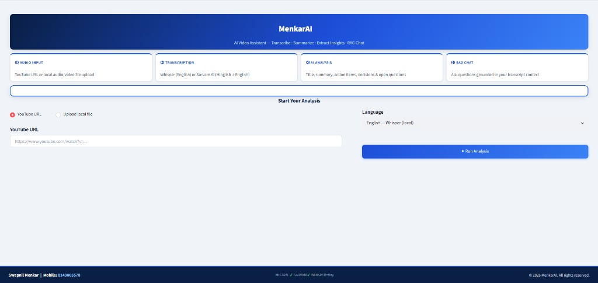
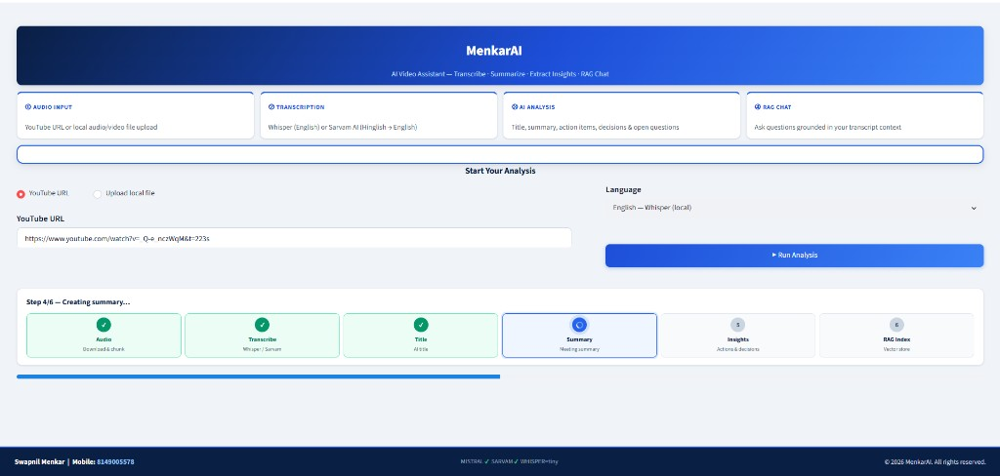
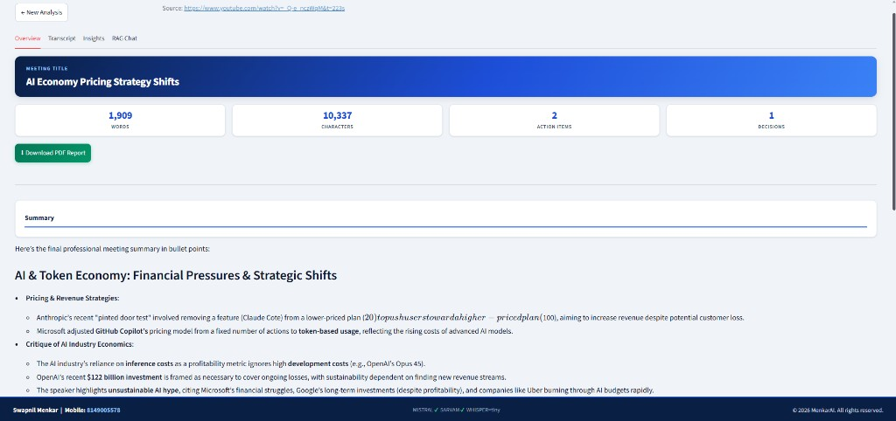
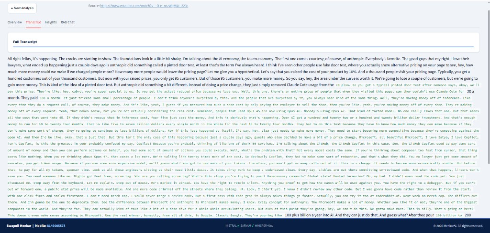
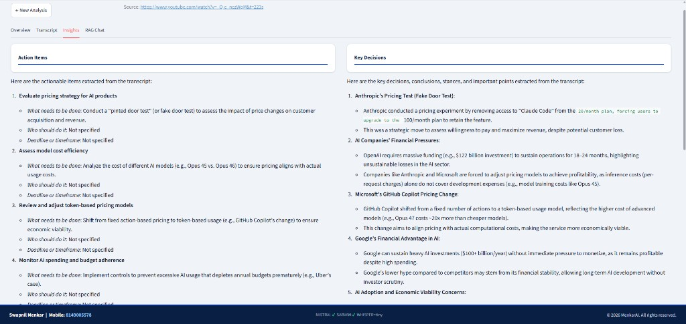
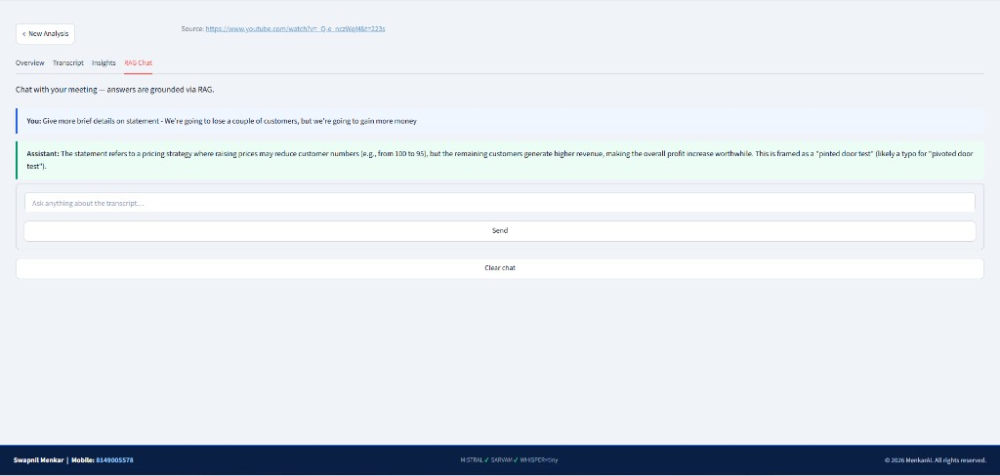
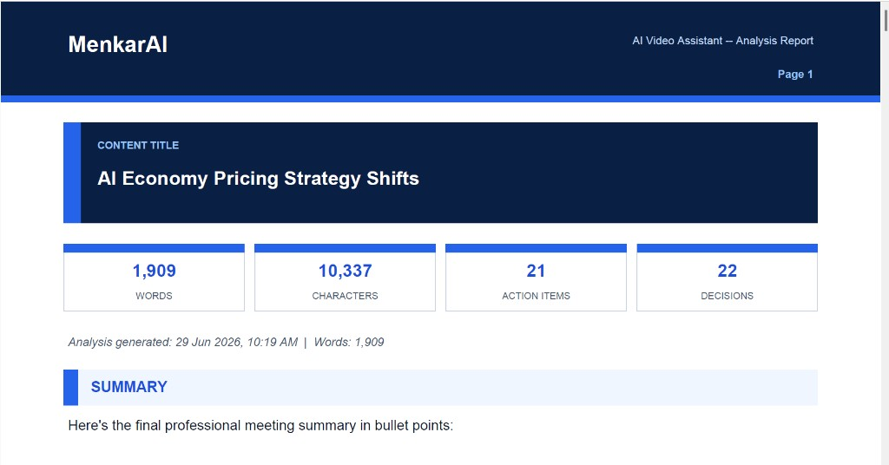

<div align="center">

# 🎬 MenkarAI — AI Video Assistant with RAG

### Transcribe · Summarise · Extract Insights · Chat with Your Content

[](https://python.org)
[](https://streamlit.io)
[](https://langchain.com)
[](https://mistral.ai)
[](https://www.trychroma.com)
[](LICENSE)

> **Turn any YouTube video or audio file into a structured, searchable knowledge base — in seconds.**

</div>

---

## 📋 Table of Contents

| # | Section |
|---|---------|
| 1 | [Overview](#-overview) |
| 2 | [Live Screenshots](#-live-screenshots) |
| 3 | [Architecture](#-architecture) |
| 4 | [Features & Capabilities](#-features--capabilities) |
| 5 | [Pipeline Flow](#-pipeline-flow) |
| 6 | [Tech Stack](#-tech-stack) |
| 7 | [Project Structure](#-project-structure) |
| 8 | [Quick Start](#-quick-start) |
| 9 | [Configuration](#-configuration) |
| 10 | [CLI Usage](#-cli-usage) |
| 11 | [API Keys Setup](#-api-keys-setup) |
| 12 | [Supported Languages](#-supported-languages) |
| 13 | [Author](#-author) |

---

## 🌟 Overview

**MenkarAI** is a full-stack AI-powered video analysis assistant that converts any YouTube video or local audio/video file into a structured knowledge base. It transcribes speech, generates AI-powered summaries and insights, extracts actionable information, and enables interactive question-answering — all grounded in the actual content via Retrieval-Augmented Generation (RAG).

```
YouTube URL  ──┐
               ├──▶  Audio Extraction  ──▶  Transcription  ──▶  AI Analysis  ──▶  RAG Chat
Local File  ───┘
                       yt-dlp / pydub       Whisper / Sarvam     Mistral AI        ChromaDB
```

---

## 📸 Live Screenshots

### 1 · Home Screen — Input & Feature Overview

<p align="center">
  
</p>

> **Clean single-viewport home screen.** Enter a YouTube URL or upload a local file, choose the transcription language, and click **Run Analysis**. Four feature cards at the top orient the user to what the pipeline delivers.

---

### 2 · Live Analysis Progress Tracker

<p align="center">
  
</p>

> **Animated 6-step pipeline tracker.** Each step (Audio → Transcribe → Title → Summary → Insights → RAG Index) lights up with a pulsing animation as it runs. Completed steps turn green with a ✓ checkmark.

---

### 3 · Overview Tab — Summary & Stats

<p align="center">
  
</p>

> **AI-generated content title** displayed in a branded navy card. Four metric boxes show word count, character count, action item count, and decision count. A PDF download button and the full AI summary appear below.

---

### 4 · Transcript Tab — Full Verbatim Text

<p align="center">
  
</p>

> **Complete verbatim transcript** produced by Whisper (English) or Sarvam AI (Hinglish → English). Scrollable panel with clean typography for easy reading and copy-paste.

---

### 5 · Insights Tab — Action Items & Key Decisions

<p align="center">
  
</p>

> **Two-column insights layout.** Left panel lists extracted action items with owner and deadline context. Right panel lists key decisions, strategic conclusions, and important stances found in the content.

---

### 6 · RAG Chat Tab — Grounded Q&A

<p align="center">
  
</p>

> **Chat with your content.** Every answer is grounded in the actual transcript via ChromaDB vector retrieval — no hallucination risk. User messages appear with a blue left-border; assistant answers with a green left-border.

---

### 7 · PDF Report — Branded Export

<p align="center">
  
</p>

> **Fully branded PDF report** matching the app's colour scheme. Every page has a navy header (MenkarAI logo + tagline + page number) and a navy footer (contact info + generation timestamp + copyright). Includes title card, metric stats, summary, action items, decisions, questions, and full transcript.

---

## 🏗 Architecture

```
┌─────────────────────────────────────────────────────────────────────────────┐
│                           MenkarAI Architecture                             │
├─────────────────┬───────────────────────┬───────────────────────────────────┤
│  INPUT LAYER    │   PROCESSING LAYER    │         OUTPUT LAYER              │
├─────────────────┼───────────────────────┼───────────────────────────────────┤
│                 │                       │                                   │
│  YouTube URL    │  ┌─────────────────┐  │  ┌──────────────────────────────┐ │
│  ─────────────▶ │  │ Audio Processor │  │  │  Streamlit Web App (app.py)  │ │
│                 │  │  yt-dlp         │  │  │  ┌────────┬───────────────┐  │ │
│  Local File     │  │  pydub chunks   │  │  │  │Overview│Transcript     │  │ │
│  ─────────────▶ │  │  static-ffmpeg  │  │  │  ├────────┼───────────────┤  │ │
│  (.mp3/.mp4/    │  └────────┬────────┘  │  │  │Insights│RAG Chat       │  │ │
│   .wav/.m4a…)   │           │           │  │  └────────┴───────────────┘  │ │
│                 │           ▼           │  │  + PDF Export                 │ │
│                 │  ┌─────────────────┐  │  └──────────────────────────────┘ │
│                 │  │  Transcriber    │  │                                   │
│                 │  │  ┌───────────┐  │  │  ┌──────────────────────────────┐ │
│                 │  │  │  Whisper  │  │  │  │    CLI Entry (main.py)        │ │
│                 │  │  │ (English) │  │  │  │  Interactive terminal mode    │ │
│                 │  │  ├───────────┤  │  │  └──────────────────────────────┘ │
│                 │  │  │ Sarvam AI │  │  │                                   │
│                 │  │  │(Hinglish) │  │  │  ┌──────────────────────────────┐ │
│                 │  │  └───────────┘  │  │  │      PDF Report (fpdf2)       │ │
│                 │  └────────┬────────┘  │  │  Navy branded, all pages      │ │
│                 │           │           │  └──────────────────────────────┘ │
│                 │           ▼           │                                   │
│                 │  ┌─────────────────┐  │                                   │
│                 │  │  AI Analysis    │  │                                   │
│                 │  │  (Mistral LLM)  │  │                                   │
│                 │  │  • Title        │  │                                   │
│                 │  │  • Summary      │  │                                   │
│                 │  │  • Action Items │  │                                   │
│                 │  │  • Decisions    │  │                                   │
│                 │  │  • Questions    │  │                                   │
│                 │  └────────┬────────┘  │                                   │
│                 │           │           │                                   │
│                 │           ▼           │                                   │
│                 │  ┌─────────────────┐  │                                   │
│                 │  │  RAG Pipeline   │  │                                   │
│                 │  │  HuggingFace    │  │                                   │
│                 │  │  Embeddings     │  │                                   │
│                 │  │  ChromaDB store │  │                                   │
│                 │  │  LangChain LCEL │  │                                   │
│                 │  └─────────────────┘  │                                   │
└─────────────────┴───────────────────────┴───────────────────────────────────┘
```

---

## ✨ Features & Capabilities

### 🎙 1 · Audio & Video Acquisition

| Capability | Details |
|---|---|
| **YouTube Download** | Downloads audio from any public YouTube URL using `yt-dlp` with JS challenge support (`yt-dlp-ejs`) |
| **Local File Support** | Accepts `.mp3`, `.mp4`, `.wav`, `.m4a`, `.ogg`, `.flac`, `.webm`, `.mkv` and more |
| **Auto Chunking** | Splits long audio into manageable segments using `pydub` for reliable transcription |
| **Zero System Dependencies** | Uses bundled `static-ffmpeg` — no manual ffmpeg installation required |

---

### 📝 2 · Speech-to-Text Transcription

| Engine | Language | Description |
|---|---|---|
| **OpenAI Whisper** | English | Local model (tiny → large), runs fully offline on CPU or CUDA GPU |
| **Sarvam AI** | Hinglish (Hindi + English) | Cloud API — `saaras:v3` model, translates mixed Hindi/English to clean English |

- Automatic per-chunk progress reporting
- Sarvam audio pieces are split into ≤25s segments (API limit compliance)
- Language tag cleanup (`<|hi|>` etc.) applied automatically
- Model size configurable via `.env` (`WHISPER_MODEL=base`)

---

### 🤖 3 · AI-Powered Analysis (Mistral LLM)

All analysis is performed using **Mistral AI** via LangChain LCEL chains:

| Analysis Type | Output |
|---|---|
| **Title Generation** | Concise, descriptive content title (3–8 words) |
| **Meeting Summary** | Structured bullet-point summary with key topics |
| **Action Items** | Numbered list with "what to do", "who should do it", "by when" |
| **Key Decisions** | Strategic conclusions, stances, and important choices made |
| **Open Questions** | Unresolved questions and follow-up items from the content |

> Prompts are designed as a **general content analyst** — works equally well for meetings, YouTube videos, podcasts, lectures, and discussions.

---

### 🔍 4 · RAG (Retrieval-Augmented Generation)

```
Transcript
    │
    ▼
LangChain TextSplitter  ──▶  Chunks
                                │
                                ▼
                    HuggingFace Embeddings
                    (sentence-transformers)
                                │
                                ▼
                         ChromaDB (local)
                                │
                    ┌───────────┴───────────┐
                    │                       │
               User Question         Vector Similarity
                    │                    Search (k=4)
                    └───────────┬───────────┘
                                │
                                ▼
                        Mistral LLM (LCEL)
                                │
                                ▼
                    Grounded Answer (no hallucination)
```

- **Vector store:** ChromaDB (persistent, local)
- **Embedding model:** HuggingFace `sentence-transformers`
- **Retrieval:** Top-4 similarity search
- **Chain:** LangChain LCEL `@chain` decorator pattern
- **Context window:** Full retrieved chunks passed to Mistral

---

### 🖥 5 · Streamlit Web Interface

| UI Element | Description |
|---|---|
| **Home screen** | Single-viewport layout — no scrolling needed on first load |
| **Feature cards** | 4 cards explain Audio Input, Transcription, AI Analysis, RAG Chat |
| **Input section** | Radio toggle (YouTube URL / Upload file), language selector, Run button |
| **Progress tracker** | Animated 6-step tracker with pulsing active step and green completed steps |
| **Overview tab** | Branded title card + 4 metric stat boxes + summary + PDF download |
| **Transcript tab** | Full verbatim transcript in scrollable panel |
| **Insights tab** | Two-column layout: Action Items (left) + Key Decisions (right) |
| **RAG Chat tab** | Grounded Q&A chat with conversation history and clear button |
| **Fixed footer** | Contact info, API key status (✓/✗ per key), copyright — always visible |
| **Source link** | Clickable YouTube URL displayed above results |

---

### 📄 6 · PDF Report Export

Fully branded, multi-page PDF report:

| Section | Content |
|---|---|
| **Header** (every page) | Navy banner · MenkarAI brand · Tagline · Page number |
| **Title Card** | Navy gradient card with content title |
| **Stats Row** | 4 metric boxes: Words, Characters, Action Items, Decisions |
| **Summary** | AI-generated structured summary |
| **Action Items** | Numbered action list |
| **Key Decisions** | Strategic decisions extracted |
| **Open Questions** | Unresolved follow-up questions |
| **Full Transcript** | Complete verbatim transcript (separate page) |
| **Footer** (every page) | Contact info · Generation timestamp · Copyright |

---

## 🔄 Pipeline Flow

```
                         ┌─────────────────────┐
                         │   User Input        │
                         │  (URL or File)      │
                         └──────────┬──────────┘
                                    │
                                    ▼
                    ┌───────────────────────────────┐
                    │   Step 1: Audio Processing    │
                    │   utils/audio_processor.py    │
                    │   • Download (yt-dlp)         │
                    │   • Convert to WAV            │
                    │   • Split into chunks         │
                    └───────────────┬───────────────┘
                                    │
                                    ▼
                    ┌───────────────────────────────┐
                    │   Step 2: Transcription       │
                    │   core/transcriber_with_      │
                    │        sarvam.py              │
                    │   • English → Whisper (local) │
                    │   • Hinglish → Sarvam AI API  │
                    └───────────────┬───────────────┘
                                    │
                          ┌─────────┴─────────┐
                          │                   │
                          ▼                   ▼
         ┌─────────────────────┐   ┌─────────────────────┐
         │   Step 3: Title     │   │   Step 4: Summary   │
         │   core/summarizer.py│   │   core/summarizer.py│
         │   Mistral LLM       │   │   Mistral LLM LCEL  │
         └──────────┬──────────┘   └──────────┬──────────┘
                    │                          │
                    └─────────┬────────────────┘
                              │
                              ▼
                ┌─────────────────────────────┐
                │   Step 5: Insights          │
                │   core/extractor.py         │
                │   • Action Items            │
                │   • Key Decisions           │
                │   • Open Questions          │
                │   Mistral LLM (3 chains)    │
                └──────────────┬──────────────┘
                               │
                               ▼
                ┌─────────────────────────────┐
                │   Step 6: RAG Index         │
                │   core/vector_store.py      │
                │   core/rag_engine.py        │
                │   • HuggingFace Embeddings  │
                │   • ChromaDB Vector Store   │
                │   • LangChain LCEL Chain    │
                └──────────────┬──────────────┘
                               │
                               ▼
                ┌─────────────────────────────┐
                │      Results Ready          │
                │   • Streamlit Tabs          │
                │   • PDF Export              │
                │   • RAG Chat Interface      │
                └─────────────────────────────┘
```

---

## 🛠 Tech Stack

### Core AI & ML

| Library | Version | Purpose |
|---|---|---|
| `openai-whisper` | 20250625 | Local speech-to-text (English) |
| `sarvamai` | 0.1.28 | Hinglish speech-to-text + translation API |
| `mistralai` | 2.5.0 | LLM for summarisation, extraction, RAG answers |
| `transformers` | 5.12.1 | HuggingFace model ecosystem |
| `sentence-transformers` | 5.6.0 | Sentence embedding for RAG |
| `torch` | 2.12.1 | PyTorch backend for Whisper |

### LangChain Ecosystem

| Library | Version | Purpose |
|---|---|---|
| `langchain` | 1.3.11 | Orchestration framework |
| `langchain-core` | 1.4.8 | LCEL chain primitives |
| `langchain-mistralai` | 1.1.5 | Mistral LLM wrapper |
| `langchain-huggingface` | 1.2.2 | HuggingFace embeddings wrapper |
| `langchain-chroma` | 1.1.0 | ChromaDB vector store bridge |
| `langchain-text-splitters` | 1.1.2 | Document chunking for RAG |
| `chromadb` | 1.5.9 | Local vector database |

### Audio / Video

| Library | Version | Purpose |
|---|---|---|
| `yt-dlp` | 2026.6.9 | YouTube audio download |
| `yt-dlp-ejs` | 0.8.0 | JS challenge bypass for yt-dlp |
| `pydub` | 0.25.1 | Audio conversion and chunking |
| `static-ffmpeg` | 3.0 | Bundled FFmpeg binaries |

### Frontend & Export

| Library | Version | Purpose |
|---|---|---|
| `streamlit` | 1.58.0 | Web UI framework |
| `streamlit-extras` | 1.6.0 | Additional widgets |
| `fpdf2` | 2.8.7 | PDF report generation |
| `pillow` | 12.2.0 | Image processing |

---

## 📁 Project Structure

```
AI-Video-Assistant-With-RAG/
│
├── app.py                          # Streamlit web application (main UI)
├── main.py                         # CLI entry point
├── Requirements.txt                # All Python dependencies (pinned versions)
├── .env                            # API keys (not committed — see .gitignore)
├── .gitignore                      # Comprehensive gitignore
├── README.md                       # This file
│
├── core/                           # Core pipeline modules
│   ├── transcriber_with_sarvam.py  # Whisper + Sarvam AI transcription router
│   ├── transcriber.py              # Whisper-only transcription
│   ├── summarizer.py               # Title & summary generation (Mistral)
│   ├── extractor.py                # Action items / decisions / questions (Mistral)
│   ├── rag_engine.py               # RAG chain builder and Q&A handler
│   └── vector_store.py             # ChromaDB + HuggingFace embeddings
│
├── utils/
│   └── audio_processor.py          # Audio download, conversion, chunking
│
├── downloads/                      # Temporary audio downloads (gitignored)
├── vector_db/                      # ChromaDB persistent store (gitignored)
│
└── docs/
    └── screenshots/                # UI screenshots for README
        ├── 01_home.png
        ├── 02_progress.png
        ├── 03_overview.png
        ├── 04_transcript.png
        ├── 05_insights.png
        ├── 06_rag_chat.png
        └── 07_pdf_output.png
```

---

## 🚀 Quick Start

### Prerequisites

- Python 3.10 or higher (tested on 3.14)
- Git

### 1 · Clone the Repository

```bash
git clone https://github.com/YOUR_USERNAME/AI-Video-Assistant-With-RAG.git
cd AI-Video-Assistant-With-RAG
```

### 2 · Create & Activate Virtual Environment

```bash
# Windows
python -m venv .venv
.venv\Scripts\activate

# macOS / Linux
python3 -m venv .venv
source .venv/bin/activate
```

### 3 · Install Dependencies

```bash
pip install -r Requirements.txt
```

> **Note:** `torch` installation can take several minutes. If you have a CUDA-capable GPU, Whisper will use it automatically — otherwise it runs on CPU.

### 4 · Configure API Keys

```bash
# Create .env file (never commit this file)
cp .env.example .env   # or create manually
```

Edit `.env`:

```env
MISTRAL_API_KEY=your_mistral_api_key_here
SARVAM_API_KEY=your_sarvam_api_key_here
WHISPER_MODEL=base
```

### 5 · Launch the Web App

```bash
streamlit run app.py
```

Open your browser at **http://localhost:8501**

---

## ⚙ Configuration

All configuration is managed via the `.env` file:

| Variable | Default | Description |
|---|---|---|
| `MISTRAL_API_KEY` | *(required)* | Mistral AI API key for LLM analysis |
| `SARVAM_API_KEY` | *(required for Hinglish)* | Sarvam AI API key for Hinglish transcription |
| `WHISPER_MODEL` | `base` | Whisper model size: `tiny`, `base`, `small`, `medium`, `large` |
| `SARVAM_STT_MODEL` | `saaras:v3` | Sarvam STT model version |

### Whisper Model Size Guide

| Model | VRAM / RAM | Speed | Accuracy |
|---|---|---|---|
| `tiny` | ~1 GB | Fastest | Basic |
| `base` | ~1 GB | Fast | Good |
| `small` | ~2 GB | Medium | Better |
| `medium` | ~5 GB | Slow | High |
| `large` | ~10 GB | Slowest | Highest |

> Start with `base` for development; use `small` or `medium` for production quality.

---

## 💻 CLI Usage

The pipeline can also be run without the Streamlit UI via the command line:

```bash
python main.py
```

You will be prompted to enter:

```
Enter YouTube URL or local file path : https://www.youtube.com/watch?v=...
Language (english / hinglish): english
```

The CLI outputs:

```
📌 Title: AI Economy Pricing Strategy Shifts
📋 Summary: ...
✅ Action Items: ...
🔑 Key Decisions: ...
❓ Open Questions: ...

Chat with your meeting (type 'exit' to quit)
You: What did they say about pricing strategy?
Assistant: ...
```

---

## 🔑 API Keys Setup

### Mistral AI

1. Go to [console.mistral.ai](https://console.mistral.ai)
2. Sign up / log in
3. Navigate to **API Keys** → **Create new key**
4. Copy the key to `MISTRAL_API_KEY` in your `.env`

### Sarvam AI *(only needed for Hinglish)*

1. Go to [app.sarvam.ai](https://app.sarvam.ai)
2. Sign up and verify your account
3. Navigate to **API Keys**
4. Copy the key to `SARVAM_API_KEY` in your `.env`

---

## 🌐 Supported Languages

| Language | Engine | Notes |
|---|---|---|
| **English** | OpenAI Whisper (local) | Fully offline, no API key needed |
| **Hinglish** | Sarvam AI `saaras:v3` | Mixed Hindi + English → translated to English |

> **Hinglish** support handles code-switched speech where speakers alternate between Hindi and English in the same sentence — common in Indian professional and casual contexts.

---

## 📊 How RAG Works

```
1. Transcript is split into overlapping text chunks
        │
        ▼
2. Each chunk is converted to a numerical vector
   using HuggingFace sentence-transformers
        │
        ▼
3. Vectors stored in ChromaDB (local, persistent)
        │
        ▼
4. User asks a question
        │
        ▼
5. Question is also converted to a vector
        │
        ▼
6. Top-4 most similar chunks retrieved from ChromaDB
        │
        ▼
7. Retrieved chunks + question sent to Mistral LLM
        │
        ▼
8. Mistral generates an answer ONLY from retrieved context
   → No hallucination, fully grounded in your content
```

---

## 🔒 Security & Privacy

- ✅ `.env` file is **gitignored** — API keys are never committed
- ✅ Audio files and downloads are **gitignored**
- ✅ Vector database is **gitignored**
- ✅ No data is sent to external servers except: Mistral API (transcript text for analysis), Sarvam API (audio chunks, only when Hinglish is selected)
- ✅ All HTML user input is escaped via `html.escape()` before rendering in Streamlit
- ✅ Local Whisper transcription runs entirely offline

---

## 👤 Author

<div align="center">

| | |
|:---:|:---|
| **Name** | Swapnil Menkar |
| **Mobile** | [8149005578](tel:8149005578) |
| **LinkedIn** | [linkedin.com/in/swapnil-menkar-7051852b](https://www.linkedin.com/in/swapnil-menkar-7051852b/) |

</div>

---

<div align="center">

© 2026 MenkarAI · Built with ❤ using Python, Streamlit, LangChain & Mistral AI

</div>
